<div align="center">

<!-- HERO BANNER -->


<br/>

<!-- VERSION & CORE BADGES -->
<p align="center">
  
&nbsp;
  
&nbsp;
  
&nbsp;
  
&nbsp;
  
</p>

<!-- TECH STACK PILLS -->
<p align="center">
  
&nbsp;
  
&nbsp;
  
&nbsp;
  
&nbsp;
  
&nbsp;
  
&nbsp;
  
&nbsp;
  
&nbsp;
  
</p>

<br/>

> **A full-stack AI healthcare platform** combining Machine Learning, NLP, RAG, Explainable AI, and a Material Design 3 Expressive design system into a single Streamlit multi-page application — purpose-built for early disease detection, drug discovery, heart risk analysis, and intelligent medical Q&A.

<br/>

---

</div>

## 📋 Table of Contents

- [✨ Overview](#-overview)
- [🆕 What's New — Latest Changes](#-whats-new--latest-changes)
- [🔬 Codebase Audit Snapshot](#-codebase-audit-snapshot)
- [🗺️ Architecture Diagram](#️-architecture-diagram)
- [🖼️ Project Screenshots](#️-project-screenshots)
- [🧩 Modules — Deep Dive](#-modules--deep-dive)
  - [🏠 Home — Landing Page](#-home--landing-page)
  - [🔍 Module 1 — Disease Prediction & Medical Recommendation](#-module-1--disease-prediction--medical-recommendation)
  - [💊 Module 2 — Drug Recommendation (MedMatch AI)](#-module-2--drug-recommendation-medmatch-ai)
  - [❤️ Module 3 — Heart Disease Risk Assessment](#️-module-3--heart-disease-risk-assessment)
  - [🤖 Module 4 — Medibot AI Health Assistant](#-module-4--medibot-ai-health-assistant)
  - [🎙️ Voice Input — Cross-Browser Architecture](#️-voice-input--cross-browser-architecture-)
- [🧭 End-to-End Workflows](#-end-to-end-workflows)
- [🧩 Floating Speed-Dial Widget](#-floating-speed-dial-widget)
- [🎨 UI Design System](#-ui-design-system)
- [🗂️ Project Structure](#️-project-structure)
- [⚙️ Tech Stack](#️-tech-stack)
- [🧰 Technology Logo Wall](#-technology-logo-wall)
- [📊 Datasets](#-datasets)
- [📦 Pre-trained Models](#-pre-trained-models)
- [📈 Model Performance](#-model-performance)
- [🚀 Getting Started](#-getting-started)
- [🔑 Environment Variables](#-environment-variables)
- [🧪 Testing & Validation Notes](#-testing--validation-notes)
- [🗺️ Roadmap](#️-roadmap)
- [👨‍💻 Creator](#-creator)
- [🤝 Contributing](#-contributing)
- [📜 License](#-license)

---

## ✨ Overview

**SmartHealthCare AI v2.0.1** is a cutting-edge, multi-module medical intelligence platform. It brings together four distinct AI-powered healthcare tools — Disease Prediction, Drug Recommendation, Heart Risk Assessment, and a RAG Chatbot — under one unified **Material Design 3 Expressive** interface with full **dark / light theme support**, responsive layout, micro-animations, and a **floating speed-dial widget** on every page.

<br/>

**What defines this platform:**

- Every page has a **persistent floating speed-dial navigation widget** (draggable, animated, keyboard-accessible) that lets users jump to any section or tab without scrolling
- **Medibot** is a full 5-tab mini-app with live symptom checker, medication reminders, a lifestyle health score quiz, saved answer bookmarks, a chat stats bar, and a **cross-browser voice input** system
- **Drug Recommendation** now features 9 navigation pages including new **Drug Detail**, **Watchlist**, and **Drug Interaction Checker** pages
- **Heart Disease Risk Assessment** has 6 deep tabs covering assessment, SHAP insights, tools, a wellness hub, history trends, and a project overview
- **Home** features an interactive quick health self-assessment, symptom triage check, vital signs reference, recommended health screening timeline, and technology stack section

<br/>

```
╔══════════════════════════════════════════════════════════════════════════════╗
║             SmartHealthCare AI  v2.0.1  —  Material Design 3 Expressive       ║
║                                                                              ║
║  ┌────────────┐  ┌────────────┐  ┌────────────┐  ┌────────────┐            ║
║  │ 🔍 Disease  │  │ 💊 Drug    │  │ ❤️  Heart  │  │ 🤖 Medibot │            ║
║  │ Prediction  │  │ MedMatch   │  │ Risk Eval  │  │  RAG Bot   │            ║
║  │            │  │            │  │            │  │            │            ║
║  │RandomForest│  │NLP+Cosine  │  │LightGBM +  │  │Mistral+    │            ║
║  │ 42 classes │  │Similarity  │  │SHAP + PDF  │  │FAISS + RAG │            ║
║  │            │  │+Watchlist  │  │            │  │🎙️ Voice In │            ║
║  └────────────┘  └────────────┘  └────────────┘  └────────────┘            ║
║                                                                              ║
║  ┌───────────────────────────────────────────────────────────────────────┐  ║
║  │  🎨 Material Design 3 Expressive  |  ☀️/🌙 Dark-Light Theme Toggle   │  ║
║  │  🔘 Floating Speed-Dial Widget on EVERY page  |  📱 Responsive Grid  │  ║
║  └───────────────────────────────────────────────────────────────────────┘  ║
╚══════════════════════════════════════════════════════════════════════════════╝
```

---

## 🆕 What's New — Latest Changes

> This section documents **all recent additions and changes** to the codebase that expand upon the original v2.0.1 feature set.

<br/>

### 🎨 Typography System Overhaul

The global typeface pair has been updated across the platform for improved readability and modern aesthetics:

| Module | Previous Fonts | Updated Fonts |
|---|---|---|
| **Home (`home.py`)** | Inter (dark) / DM Serif Display + DM Sans (light) | **Outfit** (display) + **Plus Jakarta Sans** (body) |
| **Drug Recommendation** | Custom per-page fonts | **Nunito** (display) + **Space Grotesk** (body) → inner view: **Outfit** + **DM Sans** |
| **Heart Risk Assessment** | Inter | **Sora** (display) + **DM Sans** (body) |
| **Medibot** | Inter | **DM Sans** throughout + **Space Grotesk** in footer |
| **Disease Prediction** | Inter | **DM Sans** body font |

These choices result in a crisper, more expressive feel across both dark and light modes with significantly improved heading hierarchy.

<br/>

### 💊 Drug Recommendation — 5 Brand-New Pages

Module 2 has been substantially expanded. The sidebar navigation now contains **9 pages** (up from 4), including five completely new sections:

| New Page | Nav Label | Description |
|---|:---:|---|
| **🏠 Home** | `Home` | New landing dashboard for the drug module — stats, hero, featured drugs |
| **⚖️ Compare** | `Compare` | Side-by-side two-drug comparison — descriptions, similarity score, and buy links |
| **🔬 Drug Detail** | `Drug Detail` | Full single-drug profile page — composition, description, similarity neighbours, interaction guidance, and auto-add to Watchlist |
| **📋 Watchlist** | `Watchlist` | Personal drug watchlist — add/remove medicines, view count, clear all; session-persistent |
| **⚗️ Drug Interaction Checker** | `Interactions` | Multi-drug interaction surface — selects a set of medicines, computes pairwise similarity scores, flags pairs for pharmacist review |

**Also new in the Drug module:**

- **Auto-add to Watchlist toggle** on the Recommend page — any searched drug is automatically saved to the Watchlist without a manual action
- Drug Detail page shows **Interaction Guidance** section alongside top similar alternatives

<br/>

### 🤖 Medibot — Chat Stats Bar

The Chat tab now renders a **live stats bar** above the conversation, showing:

- 📖 Estimated reading time (words ÷ 200 wpm, minimum 1 minute)
- 📝 Total word count across the conversation
- 💬 Total message count
- ⬇ Export Chat button (downloads full conversation as `.txt`)

This makes the conversation context immediately visible and the export action more prominent.

<br/>

### 📐 Responsive & Layout Improvements

- Streamlit's sidebar toggle button (`[data-testid="stSidebarCollapsedControl"]`) overflow is now clipped via `Material Symbols Rounded` ligature constraints — fixing text bleed on narrow viewports
- All pages enforce `overflow-x: hidden` on `html, body` to prevent horizontal scroll bleed on mobile
- Sidebar content uses `overflow-x: hidden` independently of the sidebar panel to prevent inner content overflow
- Drug module sidebar nav link active state now highlights correctly with the page-specific accent colour

---

## 🔬 Codebase Audit Snapshot

<!-- README_REFRESH_AUDIT_SNAPSHOT -->

> This section was refreshed after a full pass through the uploaded project zip and the local working project. It documents the real files, model artifacts, data assets, UI surfaces, and screenshots currently present in the codebase.

<br/>

### 🧠 Application Inventory

| Layer | File / Folder | What It Does | Current Size |
|---|---|---|---:|
| 🏠 **Main entry** | `home.py` | Landing dashboard, health tips, risk awareness, self-assessment, symptom quick-check, vital signs, screening timeline, contact/footer, floating widget | ~4,319 lines |
| 🎨 **Global theme** | `theme_config.py` | Shared dark/light theme tokens, sidebar fixes, Material Design 3 inspired CSS overrides | ~1,298 lines |
| 🔍 **Disease AI page** | `pages/1_Disease-Prediction-and-medical-recommendation.py` | Random Forest symptom prediction, disease explorer, severity insights, history, medical recommendations | ~3,548 lines |
| 💊 **MedMatch AI page** | `pages/2_drug_recommendation.py` | NLP/cosine drug recommendation, drug detail, compare, watchlist, interactions, A-Z browser, dosage guide | ~3,667 lines |
| ❤️ **Heart risk page** | `pages/3_heart_Disease_Risk_Assesment.py` | LightGBM heart risk scoring, SHAP-style drivers, PDF/JSON export, wellness tools, scan studio | ~6,522 lines |
| 🤖 **Medibot page** | `pages/4_Medibot.py` | RAG chatbot, FAISS retrieval, Groq LLM, voice input, symptom checker, medication reminders, saved answers | ~5,181 lines |

<br/>

### 🗃️ Verified Data Assets

| Dataset | Rows | Columns | Used By | Purpose |
|---|---:|---:|---|---|
| `data/Disease-Prediction-and-Medical dataset/Training.csv` | 4,920 | 133 | Disease Prediction | Binary symptom matrix + prognosis labels for model inference and disease profile matching |
| `data/Disease-Prediction-and-Medical dataset/Symptom-severity.csv` | 133 | 2 | Disease Prediction | Severity weights used to score symptom importance |
| `data/Disease-Prediction-and-Medical dataset/symptoms_df.csv` | 4,920 | 6 | Disease Prediction | Symptom-to-disease source records |
| `data/Disease-Prediction-and-Medical dataset/description.csv` | 41 | 2 | Disease Prediction | Disease descriptions shown in recommendations |
| `data/Disease-Prediction-and-Medical dataset/precautions_df.csv` | 41 | 6 | Disease Prediction | Four precaution fields per disease |
| `data/Disease-Prediction-and-Medical dataset/medications.csv` | 41 | 2 | Disease Prediction | Disease-to-medication suggestions |
| `data/Disease-Prediction-and-Medical dataset/diets.csv` | 41 | 2 | Disease Prediction | Diet recommendations per disease |
| `data/Disease-Prediction-and-Medical dataset/workout_df.csv` | 410 | 4 | Disease Prediction | Workout guidance grouped by disease |
| `data/Drug reccomendation/medicine.csv` | 9,720 | 4 | MedMatch AI | Drug names, reasons, and descriptions for recommendation cards |
| `data/medibot data/*.pdf` | 2 PDFs | Text corpus | Medibot | Medical reference documents used to build or rebuild the FAISS vector store |

<br/>

### 📦 Verified Model / Index Artifacts

| Artifact | Module | Role |
|---|---|---|
| `models/first_feature_models/RandomForest.pkl` | 🔍 Disease Prediction | Predicts likely disease classes from symptom feature vectors |
| `models/second_feature_models/medicine_dict.pkl` | 💊 MedMatch AI | Preserves medicine order/name mapping used by the similarity model |
| `models/second_feature_models/similarity.joblib` | 💊 MedMatch AI | Precomputed cosine similarity matrix for fast alternative medicine lookup |
| `models/third_feature_models/best_model.pkl` | ❤️ Heart Risk | Trained heart disease risk classifier used for probability scoring |
| `models/third_feature_models/cbe_encoder.pkl` | ❤️ Heart Risk | Categorical encoder for BRFSS-style user inputs |
| `models/third_feature_models/brfss2022_data_wrangling_output.zip` | ❤️ Heart Risk | Processed model-training support artifact from the BRFSS pipeline |
| `vectorstore/db_faiss/index.faiss` | 🤖 Medibot | FAISS vector index for semantic retrieval |
| `vectorstore/db_faiss/index.pkl` | 🤖 Medibot | LangChain/FAISS metadata and document mapping |

<br/>

### 🖼️ Verified Visual Assets

| File | Size | Dimensions | README Usage |
|---|---:|---:|---|
| `utils/combined.png` | ~1.76 MB | 1536 × 1024 | Home / full platform screenshot |
| `utils/dpi.png` | ~83 KB | 713 × 489 | Disease Prediction module screenshot |
| `utils/dri.png` | ~72 KB | 754 × 491 | Drug Recommendation module screenshot |
| `utils/hri.png` | ~83 KB | 739 × 470 | Heart Risk module screenshot |
| `utils/mbi.png` | ~75 KB | 723 × 497 | Medibot module screenshot |
| `utils/home2.png` | ~209 KB | 2813 × 1875 | Home hero image in the app |
| `utils/ph2.png`, `utils/ph3.png`, `utils/ph4.png` | mixed | mixed | Sidebar/branding/medical visuals |
| `utils/yatin_sharma_github_dp.svg` | ~25 KB | SVG | Creator/GitHub profile branding |

<br/>

### ✅ Codebase-Level Highlights

| Area | Confirmed Implementation |
|---|---|
| 🧭 Navigation | Streamlit multipage app plus per-module internal navigation, radio/tabs, sidebars, and draggable speed-dial widgets |
| 🎨 Design | Material Design 3 Expressive styling, dark/light theme support, responsive mobile handling, custom CSS tokens |
| ⚡ Performance | `st.cache_data` and `st.cache_resource` used for expensive data/model/vector-store loading |
| 🔐 Privacy posture | Most model inference happens locally; Medibot requires `GROQ_API_KEY`; scan processing is local inside the browser/session |
| 📤 Exports | Heart module exports PDF and JSON; Medibot exports chat text; scan studio exports enhanced images |
| 🧠 AI coverage | Classical ML, similarity search, explainability, vector retrieval, LLM generation, and speech-to-text |
| 🧩 UX polish | Session history, bookmarks/watchlists, quick actions, sliders, animated cards, responsive grids, and floating widgets |


## 🗺️ Architecture Diagram

```
                        ┌──────────────────────────────────┐
                        │        home.py  (Entry Point)     │
                        │   theme_config.py (Global CSS)    │
                        └──────────────┬───────────────────┘
                                       │  Streamlit Multi-Page
          ┌───────────────────┬────────┴────────┬────────────────────┐
          ▼                   ▼                  ▼                    ▼
  ┌──────────────┐   ┌──────────────┐   ┌──────────────┐   ┌──────────────┐
  │  1_Disease   │   │   2_Drug     │   │  3_Heart     │   │  4_Medibot   │
  │  Prediction  │   │Recommendation│   │  Risk Assess │   │  RAG Chatbot │
  │  (DM Sans)   │   │(Nunito/Outfit│   │ (Sora/DM Sans│   │  (DM Sans)   │
  └──────┬───────┘   └──────┬───────┘   └──────┬───────┘   └──────┬───────┘
         │                  │                   │                   │
         ▼                  ▼                   ▼                   ▼
  RandomForest.pkl   similarity.joblib   best_model.pkl      FAISS index
  Training.csv       medicine_dict.pkl   cbe_encoder.pkl     + Groq LLM
  Symptom CSVs       medicine.csv        BRFSS 2022          + MiniLM-L6
                     + Watchlist         + PDF Export        + Whisper API
                     + Drug Detail                           + MediaRecorder
                     + Interactions                          + Chat Stats Bar
         │                  │                   │                   │
         └──────────────────┴───────────────────┴───────────────────┘
                                       │
                          ┌────────────▼─────────────┐
                          │   Streamlit Web Browser   │
                          │  + Floating Widget (FAB)  │
                          │  + Dark / Light Theme     │
                          │  + Outfit/Plus Jakarta/   │
                          │    Sora / Nunito fonts    │
                          └──────────────────────────┘
```

---

## 🖼️ Project Screenshots

<!-- README_REFRESH_PROJECT_SCREENSHOTS -->

<br/>

<div align="center">

### Screenshot 1 — Home Page / Main Dashboard

<!-- Add image name after utils/, for example: utils/your-home-screenshot.png -->
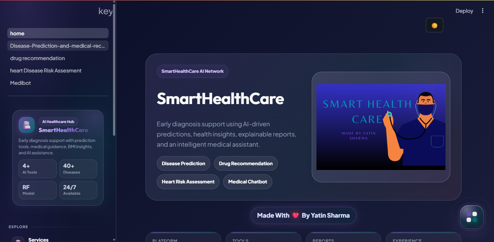

<br/><br/>

### Screenshot 2 — Disease Prediction Module

<!-- Add image name after utils/, for example: utils/your-disease-screenshot.png -->
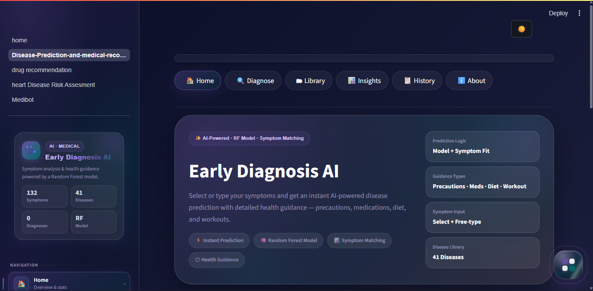

<br/><br/>

### Screenshot 3 — Drug Recommendation / MedMatch AI Module

<!-- Add image name after utils/, for example: utils/your-drug-screenshot.png -->
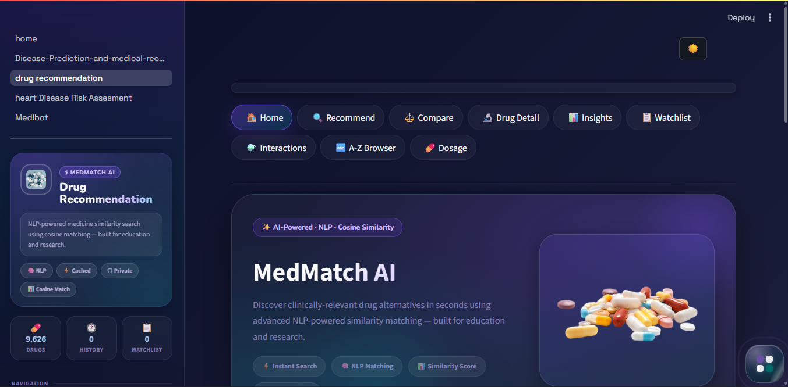

<br/><br/>

### Screenshot 4 — Heart Risk Assessment Module

<!-- Add image name after utils/, for example: utils/your-heart-screenshot.png -->
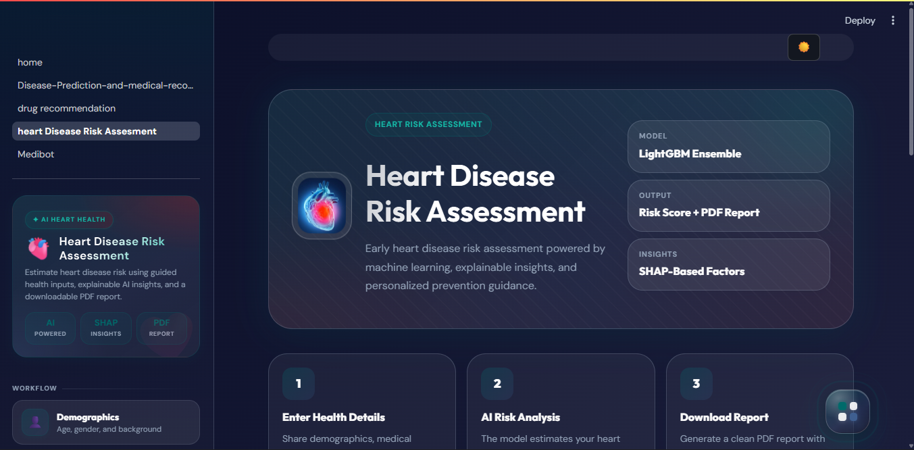

<br/><br/>

### Screenshot 5 — Medibot AI Health Assistant

<!-- Add image name after utils/, for example: utils/your-medibot-screenshot.png -->
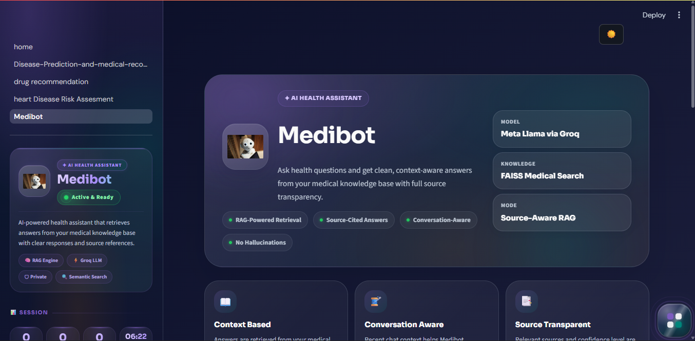

</div>

<br/>

### 📌 Screenshot Placement Map

| Project Area | Image File | Recommended Screenshot Content |
|---|---|---|
| 🏠 Home Page | `utils/` | Landing hero, cards, feature overview, and main dashboard feel |
| 🔍 Disease Prediction | `utils/` | Symptom input, prediction result, match scores, and recommendation card |
| 💊 Drug Recommendation | `utils/` | MedMatch hero/recommendation cards, compare/detail/watchlist surface |
| ❤️ Heart Risk | `utils/` | Assessment form, risk gauge, SHAP/driver cards, wellness panels |
| 🤖 Medibot | `utils/` | Chat interface, source-backed response, voice tool, tabs |

<br/>

### 🧷 Future Screenshot Slots

If you add more images later, place them in `utils/` and add them here:

| Future Area | Suggested File Name | Notes |
|---|---|---|
| 🌗 Dark/Light Theme Comparison | `utils/theme-comparison.png` | Side-by-side mode preview |
| 🧭 Floating Widget Demo | `utils/floating-widget.png` | Open speed-dial widget with page actions |
| 📄 Heart PDF Report | `utils/heart-report-preview.png` | Exported report preview |
| 🎙️ Medibot Voice Input | `utils/voice-input.png` | Recording/transcription state |
| ⚗️ Drug Interactions | `utils/drug-interactions.png` | Pairwise similarity / pharmacist review view |


## 🧩 Modules — Deep Dive

<br/>

### 🏠 Home — Landing Page


<!-- README_REFRESH_HOME_MODULE -->

<div align="center">
  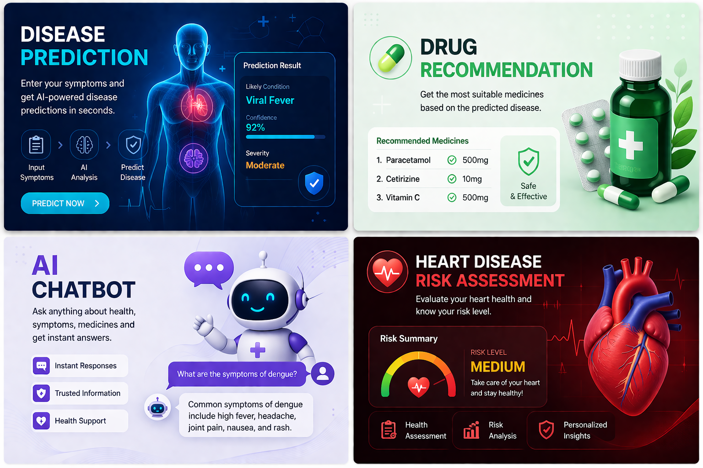
</div>

<br/>

#### 🧾 Implementation Snapshot

| Category | Details |
|---|---|
| 🧩 Primary file | `home.py` |
| 🖼️ Visual assets | `utils/home2.png`, `utils/combined.png`, `utils/ph3.png` |
| 🎨 Design layer | Custom CSS in `home.py` + shared theme hooks from `theme_config.py` |
| 🧭 Navigation | Sidebar links, feature cards, contact links, and a draggable floating speed-dial |
| 🧠 Intelligence style | Rule-based wellness scoring, symptom quick-check logic, health education content |

**Home is more than a splash screen.** It behaves like a complete healthcare command center: it introduces every AI module, provides immediate health utilities, teaches users the platform purpose, and creates a polished first impression for the full final-year project.

**Extra implementation details added from code review:**

- Uses `APP_TITLE = "SmartHealthCare for Early Diagnosis Using Artificial Intelligence"` for the Streamlit page title.
- Renders a rich hero with platform chips for Disease Prediction, Drug Recommendation, Heart Risk Assessment, and Medical Chatbot.
- Includes daily health tips, disease risk awareness cards, quick health self-assessment, symptom quick-check, vital signs reference, screening timeline, technology stack cards, creator contact, and footer.
- Uses `image_to_data_uri()` so local images can be embedded directly into HTML/CSS styled components.
- Includes a floating widget with quick jumps to Features, Health Tips, Risk Awareness, Self-Assessment, Symptom Check, Vital Signs, Timeline, Technologies, and Contact.


> *The central hub and informational gateway for SmartHealthCare AI.*

**File:** `home.py` &nbsp;|&nbsp; **Fonts:** Outfit (display) + Plus Jakarta Sans (body) &nbsp;|&nbsp; **Lines:** ~4,319

The home page is a fully interactive, content-rich landing experience. It is not just a navigation page — it contains **fourteen standalone interactive tools and sections** that provide real health utility before a user even visits a sub-module.

<br/>

**✦ Page Sections (in order)**

| # | Section | Description |
|:---:|---|---|
| 1 | **Hero Banner** | App name, tagline, key stats (42 diseases, 11K+ drugs, 400K+ training rows), tech chips |
| 2 | **Stats Row** | Live-rendered stat cards showing database sizes and model metrics |
| 3 | **Feature Cards** | Four visual cards introducing each AI module with icons and descriptions |
| 4 | **Daily Health Tips Marquee** | Auto-scrolling horizontal ticker with 15+ evidence-backed micro-habit tips |
| 5 | **Disease Risk Awareness** | 4 disease risk cards (CVD, Diabetes, Lung, Skin) with urgency bars and prevention stats |
| 6 | **Quick Health Self-Assessment** | 🆕 Interactive lifestyle quiz scoring sleep, exercise, diet, stress, smoking, hydration — returns a wellness score and personalized tip list |
| 7 | **Symptom Quick-Check** | 🆕 Category-filtered symptom grid with JavaScript-powered toggling — gives triage level (Low / Moderate / High urgency) in real time |
| 8 | **Vital Signs Reference** | Color-coded table of normal ranges for 8 vital signs (BP, HR, RR, Temp, SpO₂, BMI, BG, Cholesterol) |
| 9 | **Recommended Health Screening Timeline** | Age-banded screening recommendations (18–30, 30–45, 45–60, 60+) in a two-column card timeline |
| 10 | **Technologies Used** | Tech stack cards with icons for every library and service |
| 11 | **Why SmartHealthCare** | Three-pillar value proposition section |
| 12 | **Contact** | Creator links — GitHub, LinkedIn, Twitter, Email |
| 13 | **Footer** | Brand, version badge, disclaimer, navigation links |
| 14 | **Floating Widget** | Speed-dial FAB with 9 quick-scroll actions |

<br/>

**✦ Home Floating Widget Actions**

| Code | Label | Action |
|:---:|---|---|
| `UP` | Back to Top | Smooth-scroll to top |
| `TP` | Health Tips | Scroll to Daily Health Tips marquee |
| `RK` | Risk Awareness | Scroll to Disease Risk Awareness section |
| `VS` | Vital Signs | Scroll to Vital Signs Reference table |
| `SA` | Self Assessment | Scroll to Quick Health Self-Assessment |
| `QC` | Symptom Check | Scroll to Symptom Quick-Check |
| `JR` | Journey | Scroll to Screening Timeline |
| `AI` | Technology | Scroll to Technologies Used |
| `CT` | Contact | Scroll to creator contact section |

<br/>

**✦ Sidebar**

The home sidebar contains a profile card for the app, quick-navigation links to all 4 modules, a BMI Calculator shortcut, and a support section.

---

### 🔍 Module 1 — Disease Prediction & Medical Recommendation


<!-- README_REFRESH_DISEASE_MODULE -->

<div align="center">
  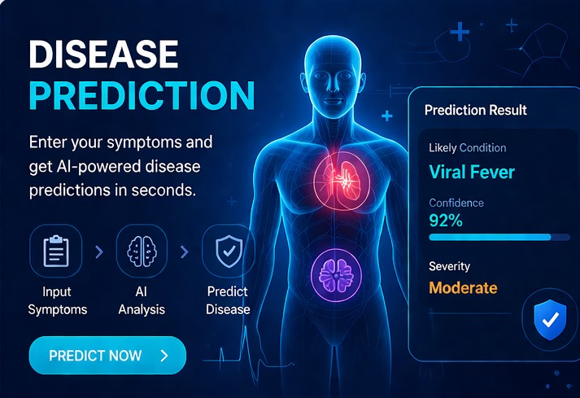
</div>

<br/>

#### 🧾 Implementation Snapshot

| Category | Details |
|---|---|
| 🧩 Primary file | `pages/1_Disease-Prediction-and-medical-recommendation.py` |
| 🤖 Model | `models/first_feature_models/RandomForest.pkl` |
| 📊 Data | Training, severity, symptoms, precautions, descriptions, medications, diets, workouts |
| 🔎 User inputs | Searchable symptom multiselect + comma-separated text area |
| 🧠 Ranking logic | Random Forest probability + severity-weighted symptom profile score |
| 🧭 Internal pages | Home, Diagnose, Library, Insights, History, About |

**Code-verified disease prediction flow:**

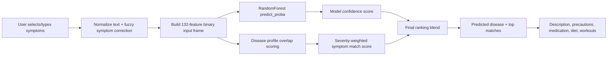

**Important implementation details:**

- `thefuzz.process.extractOne()` corrects misspelled symptoms before prediction.
- `MODEL_DISEASE_MAP` maps model class indices to canonical disease names.
- `DISEASE_ALIASES` repairs inconsistent labels from source data.
- Disease ranking combines symptom match and model confidence for more stable results.
- Severity is categorized as Mild, Moderate, or Severe using high-attention indicators such as chest pain, breathlessness, high fever, vomiting, coma, and acute liver failure.
- Session history stores disease, symptoms, severity, time, ranked dataframe, and model prediction for later review.
- The floating widget's **Focus Input** action is built to jump directly to symptom entry and recover after page rerender.


> *Predict diseases from symptoms and receive a complete, personalised care plan in seconds.*

**File:** `pages/1_Disease-Prediction-and-medical-recommendation.py` &nbsp;|&nbsp; **Font:** DM Sans &nbsp;|&nbsp; **Lines:** ~3,548

The disease prediction engine accepts user-inputted symptoms via two input modes and runs them through a trained **Random Forest Classifier** to return ranked disease predictions with confidence scores, followed by a full medical recommendation card.

<br/>

**✦ Input Methods**

| Method | Description |
|---|---|
| **Multiselect Dropdown** | Searchable widget listing all 132 symptoms in dataset |
| **Free-text Entry** | Comma-separated symptom names with RapidFuzz fuzzy normalization |

<br/>

**✦ Full Feature List**

| Feature | Details |
|---|---|
| 🎯 **Symptom Input** | 132-symptom multiselect or free-text with fuzzy normalization (RapidFuzz, threshold 80) |
| 📊 **Ranked Disease Matches** | Top 5 predictions sorted by match score + Random Forest confidence probability |
| 🚨 **Severity Assessment** | Symptom severity weights (0–7 scale from `Symptom-severity.csv`) mapped to Mild / Moderate / Severe triage |
| 💊 **Full Recommendation Card** | Disease description, precautions (up to 4 steps), medications, diet plan, and workout recommendations pulled from 6 separate CSV files |
| 📚 **Disease Library** | Browse all 41 diseases categorised by type (Infectious, Cardiac, Neurological, Skin, Metabolic, Gastrointestinal, etc.) |
| 🔬 **Symptom Insights** | Explore severity weights per symptom and disease co-occurrence patterns |
| 🕓 **Diagnosis History** | Session-based history cards with colour-coded severity timeline and timestamps |
| 🔎 **Direct Disease Search** | Bypass the ML prediction and look up any disease card directly by name |
| 🧩 **Symptom Chips** | Visual HTML chip grid for selected symptoms, colour-coded by severity |
| 📋 **Pretty List Rendering** | Stylised bullet lists for medications, diet, and workouts |

<br/>

**✦ How It Works — Pipeline**

```
User Symptoms
    │
    ├─── Multiselect: direct 132-feature binary vector
    │
    └─── Free-text: RapidFuzz normalize → binary vector
                              │
                              ▼
             RandomForest Classifier (RandomForest.pkl)
                              │
                    Probability per 42 classes
                              │
                      Ranked Top-5 diseases
                              │
              CSV Lookup (description / medications /
                  diets / workouts / precautions)
                              │
                  Full Recommendation Card → UI
```

<br/>

**✦ Floating Widget Actions (Module 1)**

| Code | Label | Action |
|:---:|---|---|
| `UP` | Back to Top | Smooth-scroll to top |
| `PR` | Predict | Scroll to prediction form |
| `LB` | Library | Scroll to disease library |
| `HT` | History | Scroll to diagnosis history |
| `IN` | Insights | Scroll to symptom insights |

<br/>

**✦ Session State Keys**

| Key | Type | Description |
|---|---|---|
| `diag_history` | `list` | Timestamped list of past diagnosis sessions |
| `last_symptoms` | `list` | Last entered symptom list |
| `last_result` | `dict` | Last prediction result dict |

---

### 💊 Module 2 — Drug Recommendation (MedMatch AI)


<!-- README_REFRESH_DRUG_MODULE -->

<div align="center">
  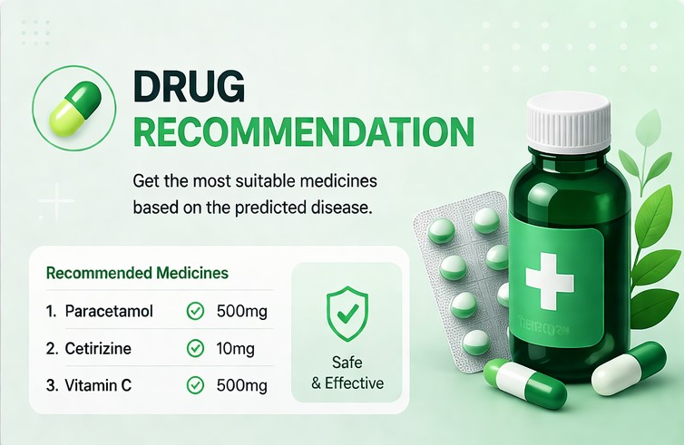
</div>

<br/>

#### 🧾 Implementation Snapshot

| Category | Details |
|---|---|
| 🧩 Primary file | `pages/2_drug_recommendation.py` |
| 🏷️ App title | `APP_TITLE = "MedMatch AI"` |
| 🧠 Model assets | `medicine_dict.pkl`, `similarity.joblib` |
| 📊 Data | `data/Drug reccomendation/medicine.csv` with 9,720 medicine records |
| ⚙️ Algorithm | Precomputed cosine similarity over medicine features/text representation |
| 🧭 Internal pages | Home, Recommend, Compare, Drug Detail, Insights, Watchlist, Interactions, A-Z Browser, Dosage |

**Code-verified recommendation flow:**

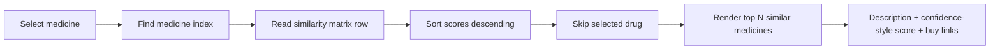

**Important implementation details:**

- `recommend_drugs()` retrieves the top similar alternatives from the precomputed matrix.
- `get_similarity_between()` powers comparison and interaction pages.
- The sidebar result-count slider controls how many recommendations are shown.
- `page_compare()` compares two medicines side by side and computes overlap between their recommendation neighborhoods.
- `page_detail()` creates a single-drug profile with description, guidance cards, similar medicines, and purchase links.
- `page_watchlist()` uses `st.session_state.watchlist` for saved medicines.
- `page_interactions()` creates a pairwise similarity matrix and flags high/moderate/low similarity pairs for pharmacist review.
- `page_az_browser()` supports alphabetic browsing for the complete medicine catalogue.
- `page_dosage()` gives educational dosage-form and administration guidance.


> *Find the best alternative medicines using NLP-powered cosine similarity — now with a full drug explorer, watchlist, and interaction checker.*

**File:** `pages/2_drug_recommendation.py` &nbsp;|&nbsp; **Fonts:** Nunito / Outfit (display) + Space Grotesk / DM Sans (body) &nbsp;|&nbsp; **Lines:** ~3,667

MedMatch AI uses **Natural Language Processing and a precomputed Cosine Similarity Matrix** to find medicines with similar properties to any selected drug. The module now features **9 sidebar navigation pages** covering everything from drug search to side-by-side comparison, personal watchlist management, and multi-drug interaction analysis.

<br/>

**✦ All Navigation Pages**

| Page | Nav Label | Description |
|---|:---:|---|
| 🏠 **Home** | `Home` | Module landing — stats row, hero banner, featured drugs carousel |
| 🔍 **Recommend** | `Recommend` | Core drug search + Top-5 cosine-similar alternatives |
| ⚖️ **Compare** | `Compare` | 🆕 Side-by-side two-drug comparison with similarity score and buy links |
| 🔬 **Drug Detail** | `Drug Detail` | 🆕 Full single-medicine profile — composition, description, similar neighbours, interaction guidance |
| 📊 **Insights** | `Insights` | Database analytics — category breakdown, similarity histograms |
| 📋 **Watchlist** | `Watchlist` | 🆕 Personal drug watchlist — save, browse, and clear medicines across the session |
| ⚗️ **Interactions** | `Interactions` | 🆕 Multi-drug interaction surface — pairwise similarity scoring and review flags |
| 🗂️ **A-Z Browser** | `AZ` | Alphabetical full medicine catalogue with letter-filter bar |
| 💊 **Dosage Safety** | `Dosage` | Category-specific medicine dosage safety checklists |

<br/>

**✦ What's New in This Module**

| Feature | Details |
|---|---|
| ⚖️ **Drug Compare Page** | Select any two drugs and compare descriptions, compositions, cosine similarity score, and PharmEasy buy links side-by-side |
| 🔬 **Drug Detail Page** | Deep-dive profile for any single medicine: description, composition, top similar alternatives, interaction guidance section, and one-click save to Watchlist |
| 📋 **Personal Watchlist** | Save drugs manually or automatically (via the Auto-add toggle on Recommend page); view all saved medicines, see their similarity neighbours, and clear the list |
| ⚗️ **Drug Interaction Checker** | Select multiple medicines and compute all pairwise similarity scores; pairs with high similarity are flagged for pharmacist review |
| 🔄 **Auto-add to Watchlist** | Checkbox toggle on the Recommend page — any drug you search is silently added to your Watchlist session |

<br/>

**✦ Dosage Safety Categories**

| Category | Icon | Safety Topics Covered |
|---|:---:|---|
| Tablets | 💊 | Splitting, timing, food interactions |
| Capsules | 🧪 | Crushing warnings, storage, water intake |
| Liquid / Syrups | 🧴 | Measuring, shaking, refrigeration |
| Inhalers | 🌬️ | Priming, technique, spacer use |
| Injectables | 💉 | Sterility, site rotation, disposal |
| Eye / Ear Drops | 👁️ | Contamination prevention, angle, interval |

<br/>

**✦ How It Works — Pipeline**

```
medicine.csv (11K drugs with descriptions)
          │
          ▼
 TF-IDF Vectorization over drug descriptions
          │
          ▼
  Cosine Similarity Matrix ─── Precomputed ──► similarity.joblib
          │
          ▼
  User selects drug ──► Row lookup in similarity matrix
          │
          ▼
  Top 5 most similar drugs retrieved + scored
          │
          ├──► Recommend page: display recommendation cards
          ├──► Compare page: two-drug side-by-side view
          ├──► Drug Detail: full profile + interaction guidance
          ├──► Watchlist: session-persistent drug saves
          └──► Interactions: pairwise matrix for n selected drugs
```

<br/>

**✦ Floating Widget Actions (Module 2)**

| Code | Label | Kind | Target |
|:---:|---|---|---|
| `HM` | Home | nav | Home |
| `RC` | Recommend | nav | Recommend |
| `VS` | Compare | nav | Compare |
| `DT` | Drug Detail | nav | Drug Detail |
| `WL` | Watchlist | nav | Watchlist |
| `IX` | Interactions | nav | Interactions |

---

### ❤️ Module 3 — Heart Disease Risk Assessment


<!-- README_REFRESH_HEART_MODULE -->

<div align="center">
  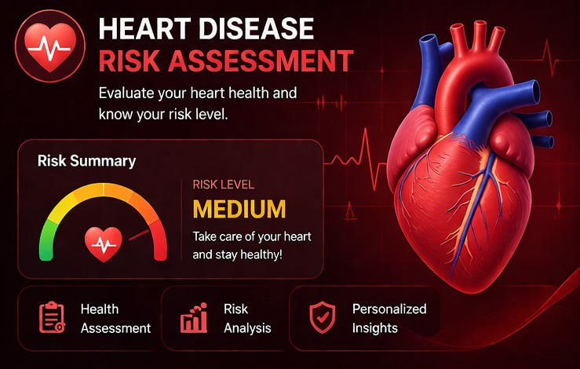
</div>

<br/>

#### 🧾 Implementation Snapshot

| Category | Details |
|---|---|
| 🧩 Primary file | `pages/3_heart_Disease_Risk_Assesment.py` |
| 🤖 Model | `models/third_feature_models/best_model.pkl` |
| 🔤 Encoder | `models/third_feature_models/cbe_encoder.pkl` |
| 📈 Explainability | SHAP / tree-model feature importance logic |
| 📤 Exports | Heart report PDF, JSON assessment export, scan image downloads |
| 🧭 Tabs | Assessment, Insights, Tools, Wellness, History, About, Scan Studio |

**Code-verified heart risk flow:**

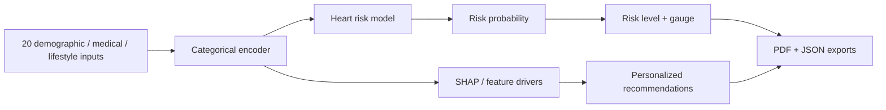

**Important implementation details:**

- Input groups include demographics, medical history, healthcare access, BMI category, smoking, alcohol, exercise, sleep, mental health, physical health, diabetes, stroke, kidney disease, and more.
- The results panel renders risk percentage, risk level, Plotly gauge, factor chips, lifestyle score, and recommendation cards.
- `create_heart_health_pdf()` generates a downloadable PDF report with risk summary and recommendations.
- JSON export includes generated timestamp, risk percent, risk level, lifestyle score, estimated heart age, input values, and recommendations.
- Tools include BMI calculator, what-if simulation, comparison chart, top drivers, lifestyle radar, risk forecast, heart Q&A, quiz, goal tracker, notes log, and global stats.
- Scan Studio accepts JPG, PNG, and WEBP cardiac scan images and creates multiple local enhancement panels for educational visual reference.
- The module explicitly states that scan data is not transmitted externally during local enhancement.


> *A clinical-grade heart risk analyser powered by LightGBM, SHAP explainability, and a full wellness toolkit.*

**File:** `pages/3_heart_Disease_Risk_Assesment.py` &nbsp;|&nbsp; **Fonts:** Sora (display) + DM Sans (body) &nbsp;|&nbsp; **Lines:** ~6,522

The heart disease risk engine takes 20 health and lifestyle inputs and runs them through a **LightGBM EasyEnsembleClassifier** trained on the CDC BRFSS 2022 dataset (~400K rows). Every prediction is explained with **SHAP TreeExplainer** values and accompanied by a six-tab wellness platform.

<br/>

**✦ Six-Tab Layout**

| Tab | Contents |
|---|---|
| **Assessment** | Input form, risk gauge, metric chips, factor chips, recommendations |
| **Insights** | SHAP waterfall chart, top feature drivers, lifestyle radar chart |
| **Tools** | BMI calculator, What-If lifestyle simulator, 5-year risk forecast, comparison chart |
| **Wellness Hub** | Heart health FAQ, knowledge quiz, goal tracker, health journal with CSV export |
| **History** | Assessment history log, risk trend line chart |
| **About** | Project overview, data sources, model card |

<br/>

**✦ Full Feature List**

| Feature | Details |
|---|---|
| 🎯 **20-Feature Input Form** | Age, BMI, BP, cholesterol, smoking, diabetes, physical activity, sleep, diet, alcohol, and 10 more BRFSS-derived features |
| 📊 **Risk Gauge** | Animated Plotly gauge showing P(heart disease) 0–100% with colour-coded zones |
| 🔬 **SHAP Explainability** | Per-prediction TreeExplainer waterfall — shows which features pushed the risk up or down |
| 📄 **PDF Export** | Full clinical report with patient data, risk score, SHAP summary, lifestyle score, and personalised recommendations (ReportLab) |
| 🗄️ **JSON Export** | Raw prediction data and SHAP values as a structured JSON download |
| 📈 **5-Year Risk Forecast** | Extrapolated risk curve based on age and current lifestyle score |
| 🌡️ **What-If Simulator** | Interactively adjust any feature and see the recalculated risk in real time |
| 🏋️ **BMI Calculator** | Metric + imperial with gradient band showing healthy / overweight / obese zones |
| 🧘 **Lifestyle Radar Chart** | Spider chart across 6 lifestyle dimensions (sleep, exercise, diet, stress, smoking, alcohol) |
| 🧠 **Heart Health FAQ + Quiz** | Expandable FAQ with evidence-backed Q&A + a scored knowledge quiz |
| 📋 **Goal Tracker + Journal** | Set health goals, log daily journal entries, export as CSV |
| 📅 **Assessment History** | Session-based log of all prior assessments with risk trend visualisation |

<br/>

**✦ How It Works — Pipeline**

```
User inputs 20 health features
          │
          ▼
  CatBoost Encoder (cbe_encoder.pkl)
  ── encodes categorical BRFSS features ──►  Encoded feature matrix
          │
          ▼
  EasyEnsembleClassifier (best_model.pkl)
  [LightGBM base estimators, class-balanced]
          │
          ▼
  P(heart disease) — float 0–1
          │
          ├──► Risk gauge + level (Low / Medium / High / Very High)
          ├──► SHAP TreeExplainer → per-feature importance
          ├──► Lifestyle score + heart age estimate
          └──► Personalised recommendations + PDF export
```

<br/>

**✦ Floating Widget Actions (Module 3)**

| Code | Label | Kind | Target |
|:---:|---|---|---|
| `UP` | Back to Top | top | — |
| `AS` | Assessment | tab | Assessment |
| `IN` | Insights | tab | Insights |
| `TL` | Tools | tab | Tools |
| `WL` | Wellness | tab | Wellness |
| `HS` | History | tab | History |
| `AB` | About | tab | About |

---

### 🤖 Module 4 — Medibot AI Health Assistant


<!-- README_REFRESH_MEDIBOT_MODULE -->

<div align="center">
  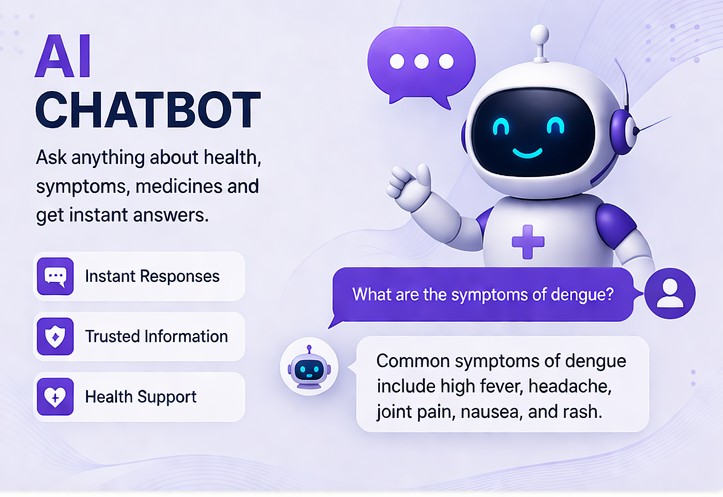
</div>

<br/>

#### 🧾 Implementation Snapshot

| Category | Details |
|---|---|
| 🧩 Primary file | `pages/4_Medibot.py` |
| 🧠 LLM | Groq-hosted `llama-3.3-70b-versatile` via `langchain_groq.ChatGroq` |
| 🔍 Retrieval | FAISS vector store in `vectorstore/db_faiss` |
| 📚 Embeddings | HuggingFace / Sentence Transformers pipeline |
| 🎙️ Voice | Browser `SpeechRecognition` path + Groq Whisper/MediaRecorder fallback |
| 🧭 Tabs | Chat, Symptom Checker, Medications, Health Score, Saved Answers |

**Code-verified Medibot flow:**

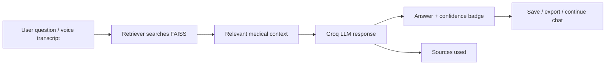

**Important implementation details:**

- Requires `GROQ_API_KEY`; the app stops early with a clear error if it is missing.
- `load_vectorstore()` loads `vectorstore/db_faiss` for semantic retrieval.
- `load_llm()` initializes Groq chat inference with temperature `0.4`.
- The chat tab includes suggestion chips, chat stats, source-backed responses, bookmarks, export chat, search, clear chat, and voice input.
- Symptom Checker provides educational severity-style triage logic.
- Medication Reminders allow local reminder tracking in session state.
- Lifestyle Health Score turns user lifestyle answers into a score and feedback.
- Saved Answers stores useful AI responses as bookmarks for later reference in the same session.
- The voice tool handles browser security constraints and supports localhost/HTTPS-friendly behavior.


> *A RAG-powered medical chatbot backed by Groq-hosted LLM and a FAISS vector database of real medical texts.*

**File:** `pages/4_Medibot.py` &nbsp;|&nbsp; **Fonts:** DM Sans body + Space Grotesk (footer) &nbsp;|&nbsp; **Lines:** ~5,181

Medibot is the most complex page — a **5-tab mini-application** built around a RAG conversational AI. It combines Groq LLM inference, FAISS semantic retrieval, and multiple wellness tools in a single unified page.

<br/>

**✦ Five-Tab Layout**

| Tab | Contents |
|---|---|
| **Chat** | Main RAG conversational interface + live chat stats bar |
| **Symptom Checker** | Interactive symptom selection and severity triage |
| **Medications** | Medication reminder manager |
| **Health Score** | Lifestyle health score quiz |
| **Saved Answers** | Bookmarked chat answers |

<br/>

**✦ Chat Tab — Full Feature List**

| Feature | Details |
|---|---|
| 💬 **Multi-turn Conversation** | Session history up to 12 messages, rendered as styled M3 chat bubbles |
| 🔗 **RAG Architecture** | Retrieves top-K context chunks from FAISS before generating every response |
| ⚡ **Groq LLM Inference** | Ultra-fast inference via Groq API (LLaMA / Mistral family models) |
| 🛡️ **Strict Prompt Template** | Prevents hallucinations — cites retrieved context, responds "I don't know" when context is insufficient |
| 📄 **Source Document Panel** | Retrieved context passages shown alongside answers for transparency |
| 🎯 **Confidence Badge** | Each response tagged as High / Medium / Low confidence with a visual badge |
| 🔍 **In-chat Search** | Search bar over conversation history to highlight matching messages |
| 🔖 **Bookmark Answers** | Save any chatbot answer to the Saved Answers tab for later reference |
| 📊 **Chat Stats Bar** | 🆕 Live stats above the conversation: estimated reading time · word count · message count |
| 📤 **Export Chat** | 🆕 Prominent export button in the stats bar — downloads full conversation as `.txt` |
| 🗑️ **Clear Chat** | Reset the conversation session |
| 💡 **Suggestion Chips** | Pre-set query chips shown when chat is empty: Common cold, Heart disease, Diabetes, etc. |
| 🩺 **Health Topics Quick-Launch** | 8 topic buttons (Nutrition, Mental Health, Exercise, Sleep, Vaccines, Medications, First Aid, Chronic Disease) that auto-populate a query |
| 🎙️ **Voice Input** | Cross-browser voice-to-text — speak your query and it is injected automatically into the chat box |

<br/>

**✦ Chat Stats Bar (New)**

The stats bar appears above the chat conversation and updates live after every message exchange:

```
📖 ~3 min read  ·  542 words  ·  8 messages         [⬇ Export Chat]
```

| Stat | Calculation |
|---|---|
| Reading time | `max(1, word_count // 200)` minutes |
| Word count | Sum of word counts across all messages |
| Message count | Total turns in the session |
| Export | Downloads plain-text transcript with role labels |

<br/>

**✦ Symptom Checker Tab**

| Feature | Details |
|---|---|
| 🎛️ **Symptom Grid** | Visual HTML chip grid of common symptoms with icons, toggleable via click or multiselect |
| 🔢 **Severity Rating** | Three-button severity selector (Mild / Moderate / Severe) per active symptom set |
| ⚠️ **Urgency Assessment** | Colour-coded urgency level output: Low (green) / Moderate (amber) / High (red — seek care) |
| 💬 **Send to Chat** | One-click button to send the symptom list directly to the Medibot chat as a structured query |

<br/>

**✦ Medication Reminders Tab**

| Feature | Details |
|---|---|
| ➕ **Add Reminders** | Form with medicine name, dose (e.g. `500mg`), and time (e.g. `08:00 AM`) |
| 📋 **Reminder List** | Styled cards showing each medicine with status badge: `Taken ✔` / `Pending` / `Missed ✗` |
| 🔄 **Toggle Status** | Click to cycle through taken / pending / missed states |
| 🗑️ **Delete Reminders** | Remove individual reminders from the list |
| 📅 **Session Persistence** | Reminders persist throughout the Streamlit session |

<br/>

**✦ Health Score Tab (Lifestyle Quiz)**

| Feature | Details |
|---|---|
| ❓ **Multi-question Quiz** | Covers: Sleep hours, Exercise frequency, Diet quality, Stress level, Smoking, Alcohol, Hydration, Screen time |
| 📊 **Weighted Scoring** | Each answer contributes to a 0–10 total wellness score |
| 🎯 **Tier Outcomes** | Score tiers: **Excellent (8–10)**, **Good (6–7)**, **Fair (4–5)**, **Needs Work (<4)** |
| 🏅 **Animated Arc Score** | SVG arc meter showing the score with tier colour |
| 💡 **Factor Breakdown Cards** | Per-category breakdown cards showing individual dimension scores |
| 🔁 **Retake Quiz** | Reset and retake button |

<br/>

**✦ Saved Answers Tab (Bookmarks)**

| Feature | Details |
|---|---|
| 🔖 **Saved Q&A Cards** | Expandable accordion cards for each saved answer |
| 📋 **Full Context** | Shows original question, answer, and confidence level |
| 🗑️ **Delete Bookmarks** | Remove individual saved answers |
| 📤 **Export All** | Export all bookmarks as a text file |

<br/>

**✦ RAG Pipeline**

```
Medical PDFs
  ├── Webster's New World Medical Dictionary
  └── Current Essentials of Medicine
            │
            ▼
  LangChain RecursiveCharacterTextSplitter
  (chunk_size = 512, overlap = 50)
            │
            ▼
  all-MiniLM-L6-v2 HuggingFace Embeddings
            │
            ▼
  FAISS Index ──── Saved: vectorstore/db_faiss/
            │
            ▼
  User Query ──► Embed query ──► cosine top-K retrieval
            │
            ▼
  Retrieved chunks + Query ──► Prompt Template
  (strict: answer from context only, cite sources,
   say "I don't know" if context is insufficient)
            │
            ▼
  Groq API (Mistral-7B / LLaMA family)
            │
            ▼
  Grounded answer + source passages → Chat UI
  + Chat Stats Bar (live word/time/message count)
```

<br/>

**✦ Knowledge Base**

| Source | Format | Content |
|---|---|---|
| `Webster's New World Medical Dictionary` | PDF | Comprehensive medical terminology and definitions |
| `Current Essentials of Medicine` | PDF | Clinical quick-reference guide for diseases, drugs, diagnostics |

<br/>

<a name="️-voice-input--cross-browser-architecture-"></a>

**✦ 🎙️ Voice Input — Cross-Browser Architecture** 🆕

Medibot includes a fully custom voice input button (`render_voice_input()`) rendered via `streamlit.components.v1.html()`. It uses a **dual-engine smart detection** system that automatically picks the right voice backend based on the browser and security context — requiring zero configuration from the user.

<br/>

**Voice Engine Selection Logic**

```
Browser opens Medibot
        │
        ├─── Is MediaRecorder available AND is context secure?
        │         (localhost, 127.0.0.1, or HTTPS)
        │
        ├── YES ──► Engine: MediaRecorder + Groq Whisper API
        │               Records audio → sends to whisper-large-v3-turbo
        │               Works in: Vivaldi ✅  Desktop Chrome ✅  Edge ✅  Firefox ✅
        │
        └── NO  ──► Engine: Web Speech API fallback
                        Native browser speech recognition
                        Works in: Android Chrome ✅  (HTTP local IP)
```

<br/>

**Engine 1 — MediaRecorder + Groq Whisper (Primary)**

| Step | Detail |
|---|---|
| **1. Record** | `navigator.mediaDevices.getUserMedia` captures mic audio with echo cancellation + noise suppression |
| **2. Encode** | `MediaRecorder` encodes in best supported format: `audio/webm;codecs=opus` → `audio/webm` → `audio/ogg` → `audio/mp4` |
| **3. Chunk** | Audio collected every 250 ms to prevent data loss on `stop()` |
| **4. Transcribe** | `Blob` sent to `https://api.groq.com/openai/v1/audio/transcriptions` using `whisper-large-v3-turbo` |
| **5. Inject** | Transcribed text injected into Streamlit's chat textarea via React's native setter + `input` event dispatch |

<br/>

**Engine 2 — Web Speech API (Fallback)**

| Fix | Detail |
|---|---|
| **Interim fallback** | Tracks `interimTranscript` separately — used in `onend` if `isFinal` never fires |
| **`hadError` flag** | Prevents duplicate error messages when both `onerror` and `onend` fire |
| **Full result accumulation** | Loops from `i = 0` across all results to catch all speech in Chromium builds |

<br/>

**Browser Compatibility Matrix**

| Browser | Context | Engine Used | Works? |
|---|---|---|---|
| Vivaldi (desktop) | `localhost` | MediaRecorder + Whisper | ✅ |
| Chrome (desktop) | `localhost` or HTTPS | MediaRecorder + Whisper | ✅ |
| Edge (desktop) | `localhost` or HTTPS | MediaRecorder + Whisper | ✅ |
| Firefox (desktop) | `localhost` or HTTPS | MediaRecorder + Whisper | ✅ |
| Chrome (Android) | `localhost` | MediaRecorder + Whisper | ✅ |
| Chrome (Android) | `http://192.168.x.x` | Web Speech API fallback | ✅ |
| Any browser | HTTPS deployment | MediaRecorder + Whisper | ✅ |

<br/>

**Voice Input UI States**

| State | Button Appearance | Status Text |
|---|---|---|
| Idle | 🎤 Speak (purple gradient) | *🎙️ Tap the mic to consult Medibot by voice* |
| Recording | ⏹ Stop (red pulse animation) | *Recording… click Stop when done* |
| Processing | Disabled | *Transcribing… please wait* |
| Success | 🎤 Speak (reset) | *✔ Inserted: [first 60 chars of transcript]…* |
| Error — mic denied | 🎤 Speak (reset) | *Mic access denied — tap the lock icon and allow microphone* |
| Error — no mic found | 🎤 Speak (reset) | *No microphone found — plug one in and try again* |
| Error — no speech | 🎤 Speak (reset) | *Nothing heard — try again* |

<br/>

**Whisper Model Details**

| Parameter | Value |
|---|---|
| Model | `whisper-large-v3-turbo` |
| API Endpoint | `https://api.groq.com/openai/v1/audio/transcriptions` |
| Language | `en` (English) |
| Response Format | `json` |
| API Key | Reuses `GROQ_API_KEY` from `.env` — no separate key needed |

> **Security note:** The `GROQ_API_KEY` is passed from Python into the JavaScript component at render time via Python f-string interpolation. It is only exposed within the Streamlit iframe sandbox and is not stored client-side.

<br/>

**✦ Floating Widget Actions (Module 4)**

| Code | Label | Kind | Target |
|:---:|---|---|---|
| `CH` | Chat | tab | Chat |
| `SC` | Symptom Checker | tab | Symptom Checker |
| `MD` | Medications | tab | Medication Reminders |
| `HS` | Health Score | tab | Lifestyle Health Score |
| `SV` | Saved Answers | tab | Saved Answers |

---

## 🧭 End-to-End Workflows

<!-- README_REFRESH_WORKFLOWS -->

### 🔍 Disease Prediction Workflow

| Step | User Action | System Behavior |
|---:|---|---|
| 1 | Select known symptoms or type symptoms manually | Normalizes text and corrects spelling with fuzzy matching |
| 2 | Click **Predict Disease** | Converts symptoms into a 132-column binary feature frame |
| 3 | Model inference runs | Random Forest returns class probabilities |
| 4 | Ranking layer runs | Severity-weighted symptom profile score is blended with model confidence |
| 5 | Result appears | Shows recognized symptoms, severity badge, top matches, and care guidance |
| 6 | History updates | Saves disease, symptoms, severity, time, ranked dataframe, and model output |

### 💊 Drug Recommendation Workflow

| Step | User Action | System Behavior |
|---:|---|---|
| 1 | Choose a medicine | Looks up medicine index from the model dictionary |
| 2 | Click recommendation action | Reads the selected row from the cosine similarity matrix |
| 3 | Recommendation list renders | Sorts most similar medicines and displays descriptions |
| 4 | Optional actions | Compare two drugs, inspect detail, add to watchlist, or check interaction-style similarity |
| 5 | Review guidance | Displays educational safety notes and purchase links where available |

### ❤️ Heart Risk Assessment Workflow

| Step | User Action | System Behavior |
|---:|---|---|
| 1 | Fill demographics, health history, access, and lifestyle form | Builds a BRFSS-style structured input dictionary |
| 2 | Click **Assess My Risk** | Encodes categorical values and runs model probability inference |
| 3 | Review result | Shows risk percent, risk category, gauge, factor chips, and lifestyle score |
| 4 | Explore insights | Shows drivers, charts, what-if tools, radar, forecast, quiz, goals, and history |
| 5 | Export | Generates PDF and JSON report artifacts |
| 6 | Optional Scan Studio | Enhances uploaded scan images locally for visual reference |

### 🤖 Medibot Workflow

| Step | User Action | System Behavior |
|---:|---|---|
| 1 | Ask a question or use voice | Captures text directly or transcribes speech |
| 2 | Retrieval runs | FAISS finds relevant chunks from medical reference documents |
| 3 | LLM answers | Groq LLM responds using retrieved context |
| 4 | Source panel renders | Shows source documents used for the answer |
| 5 | User saves/exports | Bookmarks useful answers or exports the full chat |
| 6 | Wellness tools | User can switch to symptom checker, reminders, lifestyle score, or saved answers |


## 🧩 Floating Speed-Dial Widget

> *A custom-built, draggable, animated Material Design 3 floating action button present on **all 5 pages**.*

This widget is injected via `streamlit.components.v1.html()` into Streamlit's parent `window` frame. It requires **zero external dependencies** and works entirely in vanilla JS/CSS.

<br/>

**✦ Visual Design**

- Gradient FAB button (purple → teal) with animated pulsing rings and a shimmer overlay
- Animated orbit dots that rotate around the FAB while idle
- A 4-bar icon that morphs on open/close
- A frosted-glass panel (backdrop blur + radial gradient) slides in with a spring-eased cubic-bezier animation

<br/>

**✦ Interaction Design**

| Interaction | Behaviour |
|---|---|
| **Click FAB** | Toggles the tool panel open/close with spring animation |
| **Drag FAB** | Repositions the widget anywhere on screen using pointer events — position saved to `localStorage` across reloads |
| **Click tool button** | Executes the action (scroll/tab/nav), shows a toast notification, and closes the panel |
| **Keyboard `Enter` / `Space`** | Opens/closes the panel (accessible) |
| **Keyboard `Escape`** | Closes the panel |
| **Outside click** | Closes the panel |
| **Viewport resize / scroll** | Re-clamps position within viewport bounds |

<br/>

**✦ Action Types**

| Type | How it works |
|---|---|
| `scroll` | Finds matching section heading in the parent document and smoothly scrolls to it |
| `tab` | Finds the matching `[role="tab"]` element by normalised text and clicks it |
| `nav` | Finds matching Streamlit button/radio by text and programmatically fires all pointer events |
| `top` | Custom smooth-scroll implementation targeting all Streamlit scrollable containers |
| `input` | Focuses the nearest chat input, text input, or textarea |

<br/>

**✦ Per-page Widget IDs**

| Page | Widget ID |
|---|---|
| `home.py` | `mm-widget-root-smart-healthcare` |
| `1_Disease-Prediction` | unique per-page ID |
| `2_drug_recommendation` | unique per-page ID |
| `3_heart_Disease_Risk_Assesment` | unique per-page ID |
| `4_Medibot` | `mm-widget-root-medibot` |

> Each page cleans up any previous widget instance with `querySelectorAll('[id^="mm-widget-root"]').forEach(el => el.remove())` before injecting a fresh one — preventing ghost widgets on Streamlit reruns.

---

## 🎨 UI Design System

The entire application uses a custom **Material Design 3 Expressive** design system implemented in pure CSS injected via `st.markdown(unsafe_allow_html=True)`. The system is centralised in `theme_config.py` and extended per-page.

<br/>

**✦ Theme Architecture**

```
theme_config.py
  ├── _CSS_DARK   ─── deep purple-blue gradients, rgba surfaces
  ├── _CSS_LIGHT  ─── warm lavender backgrounds, noise texture overlay,
  │                   full component token overrides
  ├── init_theme()          ─── Sets st.session_state.theme = "dark" on first load
  ├── toggle_theme()        ─── Flips between "dark" and "light"
  ├── get_theme_styles()    ─── Returns _CSS_DARK or _CSS_LIGHT string
  ├── apply_theme()         ─── Calls st.markdown(get_theme_styles())
  └── render_theme_toggle() ─── Renders ☀️/🌙 button in top-right corner
```

<br/>

**✦ Typography — Updated**

| Module | Display Font | Body Font |
|:---:|---|---|
| **Home** | `Outfit` | `Plus Jakarta Sans` |
| **Disease Prediction** | — | `DM Sans` |
| **Drug Recommendation** | `Nunito` / `Outfit` | `Space Grotesk` / `DM Sans` |
| **Heart Risk Assessment** | `Sora` | `DM Sans` |
| **Medibot** | — | `DM Sans` + `Space Grotesk` (footer) |

> All fonts are loaded via Google Fonts `@import` at the top of each module's CSS block.

<br/>

**✦ Dark Mode Design Tokens**

```css
/* Dark mode — deep purple-blue gradients */
.stApp {
  background: linear-gradient(135deg, #0a0e27 0%, #1a1d3a 100%);
}
[data-testid="stSidebar"] {
  background: linear-gradient(180deg, #1a1d3a 0%, #0a0e27 100%);
}
/* Accent */
--md-primary:   #667eea    /* Purple-blue */
--md-secondary: #764ba2    /* Violet */
```

<br/>

**✦ Light Mode Design Tokens**

```css
/* Light mode — warm lavender backgrounds */
:root {
  --lt-bg:              #f0eef9;
  --lt-bg2:             #e8e4f5;
  --lt-surface:         rgba(255, 255, 255, 0.82);
  --lt-surface-high:    rgba(255, 255, 255, 0.96);
  --lt-border:          rgba(103, 80, 164, 0.18);
  --lt-primary:         #5b3fc4;
  --lt-primary-2:       #7c5cdb;
  --lt-accent:          #00b4a6;
  --lt-accent-warm:     #f97316;
}
/* Noise texture overlay for paper-like depth */
.stApp::before {
  content: ''; position: fixed; inset: 0;
  opacity: 0.025;
  background-image: url("data:image/svg+xml,...fractalNoise...");
}
```

<br/>

**✦ Animation Classes**

| Class | Effect |
|---|---|
| `md-fade-up` | Fade + translateY(-16px→0) on entry |
| `md-scale-in` | Scale(0.94→1) + fade on entry |
| `md-float` | Continuous 3s sinusoidal float |
| `md-pulse-ring` | Pulsing opacity ring on risk badges |
| `mm-drag-pulse` | Box-shadow pulse on FAB while dragging |
| `mm-head-in` | Panel header slide-in on open |

<br/>

**✦ Responsive Behaviour**

| Breakpoint | Adjustment |
|---|---|
| `≤ 768px` | Sidebar background switches to opaque `#12101a` in light mode; sidebar toggle button overflow clipped |
| `≤ 620px` | Footer brand centres, meta text wraps, widget panel narrows to `310px` |
| `≤ 600px` | Hero logo shrinks, title scales down, metric grid goes 2-column |
| Mobile | Widget grid goes 1-column; sidebar links use tighter padding |

<br/>

**✦ Module-specific Colour Accents**

| Module | Primary Accent | Secondary |
|---|---|---|
| Home / Disease | `#6750a4` Purple | `#14b8a6` Teal |
| Drug Recommendation | `#7c4dff` Deep Purple | `#00bcd4` Cyan |
| Heart Risk | `#006a6a` Dark Teal | `#3f5f90` Steel Blue |
| Medibot | `#6750a4` Purple | `#006a6a` Teal |

<br/>

**✦ Component Catalogue**

| Component Class | Description |
|---|---|
| `.md-hero` | Multi-layer radial gradient hero card |
| `.md-kicker` | Small pill-shaped label above the title |
| `.md-title` | Display-size heading |
| `.md-subtitle` | Muted secondary heading |
| `.md-chip` | Small bordered pill with hover state |
| `.md-pill` | Stat pill with label + value layout |
| `.md-card` | Frosted-glass content card |
| `.md-stat-card` | Compact metric card |
| `.md-sidebar-hero` | Sidebar profile/hero card |
| `.md-sidebar-link` | Sidebar navigation link card |
| `.md-section-title` | Full-width section heading |
| `.md-marquee-wrap` | Auto-scrolling horizontal ticker |
| `.md-risk-card` | Risk awareness card with urgency bar |
| `.md-vital-card` | Vital sign metric display |
| `.md-timeline-card` | Health screening timeline entry |
| `.md-footer` | Page footer with brand and links |
| `.md-read-meta` | Chat stats bar reading meta text (Medibot) |

---

## 🗂️ Project Structure

```
SmartHealthCare-For-Early-Diagnosis-Using-Artificial-Intelligence/
│
├── 🏠 home.py                              # Landing page (Streamlit entry point)
├── 🎨 theme_config.py                      # Dark/Light theme engine + global CSS tokens
├── 📋 requirements.txt                     # All Python dependencies (pinned versions)
├── ⚙️  runtime.txt                          # Python 3.11.9
├── 🧪 test_token.py                        # API key validation helper
├── 🔒 .gitignore
├── 📜 LICENSE                              # MIT License
│
├── 📂 pages/                               # Streamlit multi-page modules
│   ├── 1_Disease-Prediction-and-medical-recommendation.py   # DM Sans, 3261 lines
│   ├── 2_drug_recommendation.py                             # Nunito/Outfit, 3527 lines
│   ├── 3_heart_Disease_Risk_Assesment.py                    # Sora/DM Sans, 5661 lines
│   └── 4_Medibot.py                                         # DM Sans, 4802 lines
│
├── 📂 models/                              # Pre-trained ML models
│   ├── first_feature_models/
│   │   └── RandomForest.pkl               # Disease classification model (42 classes)
│   ├── second_feature_models/
│   │   ├── similarity.joblib              # Cosine similarity matrix (drug NLP)
│   │   └── medicine_dict.pkl              # Drug metadata dictionary
│   └── third_feature_models/
│       ├── best_model.pkl                 # LightGBM EasyEnsemble heart disease model
│       ├── best_model1.pkl                # Backup model
│       ├── cbe_encoder.pkl                # CatBoost encoder for BRFSS features
│       ├── cbe_encoder1.pkl               # Backup encoder
│       └── brfss2022_data_wrangling_output.zip
│
├── 📂 data/
│   ├── Disease-Prediction-and-Medical dataset/
│   │   ├── Training.csv                   # 4,920 rows × 133 cols
│   │   ├── Symptom-severity.csv           # Severity weight (0–7) per symptom
│   │   ├── description.csv
│   │   ├── medications.csv
│   │   ├── diets.csv
│   │   ├── workout_df.csv
│   │   └── precautions_df.csv
│   ├── Drug reccomendation/
│   │   └── medicine.csv                   # ~11,000 medicine entries
│   └── medibot data/
│       ├── Webster_s New World Medical Dictionary.pdf
│       └── Current Essentials of Medicine.pdf
│
├── 📂 vectorstore/db_faiss/               # Medibot FAISS vector index
│   ├── index.faiss                        # Binary FAISS flat index
│   └── index.pkl                          # Docstore (chunk text + metadata)
│
├── 📂 medibot/                            # Medibot offline scripts
│   ├── create_memory_for_llm.py           # Ingests PDFs → builds FAISS index
│   ├── connect_memory_with_llm.py         # Standalone RAG chain setup
│   ├── readme.md
│   └── medical-chatbot-ppt.pdf
│
├── 📂 utils/                              # Assets and CSS
│   ├── yatin_sharma_github_dp.svg         # Creator profile SVG
│   ├── heart_disease.jpg
│   ├── home2.png                          # Home hero image
│   ├── medss.png                          # Medibot banner image
│   ├── ph2.png – ph4.png                  # Placeholder images
│   ├── style.css                          # Legacy CSS v2
│   └── style_v1.css                       # Legacy CSS v1
│
└── 📂 Research Notebooks/
    ├── Disease Prediction and recommendation/
    │   └── disease_prediction_system.ipynb
    ├── Drug Recommendation/
    │   └── Drug_Recommendation.ipynb
    └── heart_disease_risk_assessment/
        ├── Data_Wrangling_pre_processing_notebook.ipynb
        ├── Exploratory_data_analysis.ipynb
        └── Modeling.ipynb
```

---

## ⚙️ Tech Stack

<div align="center">

### ◈ Core Framework

| Technology | Version | Role |
|:---:|:---:|---|
|  | `3.11.9` | Runtime |
|  | `1.46.1` | Multi-page web UI framework |
|  | `1.1.1` | `.env` API key loading |
|  | `1.6.0` | Non-blocking async in Streamlit |

### ◈ Machine Learning & AI

| Technology | Version | Role |
|:---:|:---:|---|
|  | `1.6.1` | RandomForest, preprocessing, train/test split |
|  | `4.6.0` | Gradient boosting for heart disease classification |
|  | `0.13.0` | EasyEnsembleClassifier for class imbalance |
|  | `2.8.1` | CatBoost encoding for categorical BRFSS features |
|  | `0.48.0` | TreeExplainer for per-prediction feature importance |
|  | `5.0.0` | MiniLM-L6-v2 semantic embeddings |
|  | `2.7.1` | Transformer inference backend |
|  | `3.13.0` | Fuzzy symptom name normalisation |
|  | `0.22.1` | Secondary fuzzy matching |

### ◈ NLP & RAG

| Technology | Version | Role |
|:---:|:---:|---|
|  | `0.3.26` | RAG chain orchestration, text splitting |
|  | `0.3.6` | Groq LLM provider integration |
|  | `0.3.0` | HuggingFace embedding wrapper |
|  | `0.3.27` | FAISS vector store, document loaders |
|  | `1.13.2` | Vector similarity search for RAG retrieval |
|  | `4.53.2` | Tokenisers and model loading |
|  | `0.30.0` | Groq Python SDK |
|  | API | Speech-to-text transcription via Groq's Whisper endpoint |
|  | Web API | Native browser audio capture for voice recording |

### ◈ Data & Visualisation

| Technology | Version | Role |
|:---:|:---:|---|
|  | `2.3.1` | DataFrames, CSV loading, data manipulation |
|  | `2.2.6` | Numerical computing, array operations |
|  | `6.2.0` | Interactive gauges, pie, radar, line, bar charts |
|  | `4.4.10` | PDF report generation |
|  | `11.3.0` | Image processing for PDF and UI |
|  | `1.16.0` | Statistical computations |
|  | `1.5.1` | Model serialisation / deserialisation |

</div>

---

## 🧰 Technology Logo Wall

<!-- README_REFRESH_TECH_LOGO_WALL -->

<div align="center">

| Core | ML / AI | NLP / RAG | UI / Reporting |
|---|---|---|---|
| <br/>Python | <br/>scikit-learn | <br/>LangChain | <br/>Streamlit |
| <br/>NumPy | <br/>LightGBM | <br/>FAISS | <br/>CSS3 |
| <br/>Pandas | <br/>SHAP | <br/>HuggingFace | <br/>Plotly |

</div>

<br/>

### 🔧 Technology Responsibility Matrix

| Technology | Used For | Project Area |
|---|---|---|
| 🐍 **Python** | Core application logic, data processing, model loading | All modules |
| 🎈 **Streamlit** | Multipage app shell, forms, session state, tabs, charts, downloads | UI layer |
| 🐼 **Pandas** | CSV loading, dataframe display, ranking tables, summaries | Disease, Drug, Heart |
| 🔢 **NumPy** | Similarity arrays, risk arrays, numerical scoring | Drug, Disease, Heart |
| 🌲 **Random Forest** | Disease class probability prediction | Disease Prediction |
| 💡 **LightGBM / Ensemble model** | Heart disease risk probability prediction | Heart Risk |
| 🔎 **SHAP** | Explainability / feature driver analysis | Heart Risk |
| 🧬 **Category Encoders** | Transform categorical BRFSS inputs | Heart Risk |
| 💬 **LangChain** | Retrieval QA chain, prompt/context orchestration | Medibot |
| 🧠 **Groq** | LLM inference and Whisper-style voice transcription pathway | Medibot |
| 🗃️ **FAISS** | Local vector search over medical documents | Medibot |
| 🧾 **ReportLab** | PDF report generation | Heart Risk |
| 📊 **Plotly** | Risk gauge, charts, radar/forecast visualizations | Heart Risk |
| 🎨 **CSS / MD3 Expressive** | Responsive layout, animation, theme, widgets | All modules |


## 📊 Datasets

<div align="center">

| Dataset | Source | Rows × Cols | Used In |
|---|---|:---:|---|
| Disease-Symptom Training | Kaggle | `4,920 × 133` | Disease Prediction (Module 1) |
| Symptom Severity Weights | Kaggle | `133 × 2` | Severity triage (Module 1) |
| Disease Descriptions | Kaggle | `41 × 2` | Recommendation cards (Module 1) |
| Disease Medications | Kaggle | `41 × 5` | Recommendation cards (Module 1) |
| Disease Diets | Kaggle | `41 × 5` | Recommendation cards (Module 1) |
| Disease Workouts | Kaggle | `41 × 2` | Recommendation cards (Module 1) |
| Disease Precautions | Kaggle | `41 × 5` | Recommendation cards (Module 1) |
| Medicine Catalogue | Custom / PharmEasy | `~11,000 × n` | Drug Recommendation (Module 2) |
| CDC BRFSS 2022 | CDC.gov | `~400,000 × 279` | Heart Risk Assessment (Module 3) |
| Webster's Medical Dictionary | Webster's / Lange | PDF (~300pp) | Medibot RAG (Module 4) |
| Current Essentials of Medicine | Lange | PDF (~400pp) | Medibot RAG (Module 4) |

</div>

---

## 📦 Pre-trained Models

All models are pre-trained and included in the repository under `models/`. No additional training is required to run the application.

<div align="center">

| Model File | Algorithm | Trained On | Task | Classes / Output |
|---|---|---|---|---|
| `RandomForest.pkl` | Random Forest Classifier | Kaggle disease-symptom dataset | Disease classification | 42 disease classes |
| `similarity.joblib` | Cosine Similarity Matrix | Medicine catalogue (TF-IDF vectors) | Drug similarity ranking | Similarity score 0–1 |
| `medicine_dict.pkl` | Python dict | medicine.csv | Drug metadata lookup | Name → description |
| `best_model.pkl` | EasyEnsembleClassifier (LightGBM) | CDC BRFSS 2022 | Heart disease probability | P(heart disease) 0–1 |
| `best_model1.pkl` | EasyEnsembleClassifier (LightGBM) | CDC BRFSS 2022 | Backup model | P(heart disease) 0–1 |
| `cbe_encoder.pkl` | CatBoost Encoder | CDC BRFSS 2022 | Categorical encoding | Encoded feature matrix |
| `cbe_encoder1.pkl` | CatBoost Encoder | CDC BRFSS 2022 | Backup encoder | Encoded feature matrix |

</div>

> 📓 Full training pipelines, EDA, and evaluation plots are in the Jupyter notebooks under `Disease Prediction and recommendation/`, `Drug Recommendation/`, and `heart_disease_risk_assessment/`.

---

## 📈 Model Performance

<div align="center">

### Disease Prediction — Random Forest

| Metric | Value |
|:---:|:---:|
| Training Accuracy | `~98%` |
| Cross-validated Accuracy | `~95%` |
| Number of Classes | `42 diseases` |
| Feature Dimensions | `132 binary symptom columns` |
| Training Set Size | `4,920 samples` |

<br/>

### Heart Disease Risk — LightGBM EasyEnsemble

| Metric | Value |
|:---:|:---:|
| ROC-AUC | `~0.84` |
| Training Dataset | `CDC BRFSS 2022 (~400K rows)` |
| Feature Count | `20 health & lifestyle features` |
| Class Balancing Method | `EasyEnsembleClassifier` |
| Explainability Method | `SHAP TreeExplainer` |

<br/>

### Drug Recommendation — Cosine Similarity

| Metric | Value |
|:---:|:---:|
| Catalogue Size | `~11,000 medicines` |
| Vectorisation | `TF-IDF over drug descriptions` |
| Similarity Method | `Cosine similarity` |
| Recommendations per query | `Top 5` |

</div>

---

## 🚀 Getting Started

### Prerequisites

- **Python `3.11.9`** (recommended — use `pyenv` or Anaconda for version management)
- **Git**
- A **[Groq API key](https://console.groq.com/)** *(free tier available — required only for Medibot)*

<br/>

### Step 1 — Clone the Repository

```bash
git clone https://github.com/YatinSharma1303/SmartHealthCareAI.git
cd SmartHealthCareAI
```

<br/>

### Step 2 — Create a Virtual Environment

```bash
# Windows
python -m venv venv
venv\Scripts\activate

# macOS / Linux
python -m venv venv
source venv/bin/activate
```

<br/>

### Step 3 — Install Dependencies

```bash
pip install -r requirements.txt
```

> ⚠️ **Note on PyTorch:** `torch==2.7.1` is large (~2 GB). On CPU-only machines, install the lighter CPU build:
> ```bash
> pip install torch --index-url https://download.pytorch.org/whl/cpu
> ```

> ⚠️ **Note on faiss-cpu:** On some Linux distros you may need to install `libgomp` first:
> ```bash
> apt-get install libgomp1
> ```

<br/>

### Step 4 — Set Up Environment Variables

Create a `.env` file in the project root:

```env
GROQ_API_KEY=your_groq_api_key_here
```

Get your free Groq API key at [console.groq.com](https://console.groq.com). Without this key, all modules except Medibot will work normally. Medibot requires the key to call the LLM.

<br/>

### Step 5 — (Optional) Rebuild the Medibot Vector Store

The pre-built FAISS index is already included in `vectorstore/db_faiss/`. If you want to rebuild it from the source PDFs (e.g. after adding new documents):

```bash
python medibot/create_memory_for_llm.py
```

This re-embeds the medical PDFs using `all-MiniLM-L6-v2` and writes a fresh FAISS index to `vectorstore/db_faiss/index.faiss` and `index.pkl`.

<br/>

### Step 6 — Run the Application

```bash
streamlit run home.py
```

The app opens at `http://localhost:8501`. All four module pages are accessible from the Streamlit sidebar navigation.

<br/>

### Step 7 — (Optional) Validate Your API Key

```bash
python test_token.py
```

This script confirms that your `GROQ_API_KEY` in `.env` is valid before running the full app.

---

## 🔑 Environment Variables

<div align="center">

| Variable | Required | Where Used | Description |
|---|:---:|---|---|
| `GROQ_API_KEY` | ✅ For Medibot | `pages/4_Medibot.py` | API key from [console.groq.com](https://console.groq.com) for LLM inference (RAG chatbot) **and** Groq Whisper voice transcription |

</div>

> All other configuration (file paths, model paths, CSV paths, constants) is handled via Python constants defined at the top of each page file.

---

## 🧪 Testing & Validation Notes

<!-- README_REFRESH_VALIDATION_NOTES -->

This project is an applied AI healthcare prototype, so validation has two sides: **software correctness** and **responsible medical presentation**.

<br/>

### ✅ Software Checks To Run Before Submission

| Check | Command / Action | Expected Result |
|---|---|---|
| Python syntax | `python -m py_compile home.py pages/*.py` | All pages compile without syntax errors |
| Streamlit startup | `streamlit run home.py` | App opens and sidebar/pages load |
| Disease model load | Open Disease Prediction page | Random Forest and disease datasets load without error |
| Drug model load | Open MedMatch AI page | Similarity matrix and medicine dictionary load |
| Heart model load | Open Heart Risk page | Model and categorical encoder load |
| Medibot API key | Add `GROQ_API_KEY` to `.env` | Medibot loads vector store and answers questions |
| Screenshot paths | Confirm `utils/combined.png`, `dpi.png`, `dri.png`, `hri.png`, `mbi.png` exist | README renders all module images |

<br/>

### 🩺 Responsible AI / Medical Safety Notes

- This project is for **education, research, and demonstration**.
- It is **not a medical device** and must not replace licensed medical care.
- Medication guidance must be interpreted only as educational support.
- Heart risk outputs are probabilistic estimates, not formal diagnoses.
- Medibot answers should be reviewed with source context and professional judgement.
- Severe symptoms such as chest pain, breathlessness, stroke signs, severe bleeding, confusion, or loss of consciousness require urgent medical attention.

<br/>

### 🧷 Recommended Manual Demo Script

| Demo Step | What To Show |
|---:|---|
| 1 | Open `home.py`, show hero, cards, health tips, self-assessment, and floating widget |
| 2 | Open Disease Prediction, select 3-5 symptoms, run prediction, show recommendations/history |
| 3 | Open MedMatch AI, search a drug, show similar medicines, compare, watchlist, and interactions |
| 4 | Open Heart Risk, complete sample assessment, show risk gauge, insights, PDF/JSON export, Scan Studio |
| 5 | Open Medibot, ask a health question, show sources, voice input, symptom checker, reminders, and saved answers |


## 🗺️ Roadmap

**✅ Completed**

- [x] Disease prediction with 42 disease classes and full recommendation cards
- [x] Drug recommendation with NLP cosine similarity and PharmEasy buy links
- [x] Drug Dosage Safety Checker (6 medicine categories)
- [x] **Drug Compare** — side-by-side two-drug similarity and description view
- [x] **Drug Detail** — full single-drug profile with interaction guidance
- [x] **Drug Watchlist** — session-persistent personal drug save list with auto-add toggle
- [x] **Drug Interaction Checker** — pairwise similarity matrix for multiple selected drugs
- [x] Heart risk assessment with SHAP explainability + PDF export + JSON export
- [x] 5-year risk forecast + lifestyle radar chart
- [x] BMI Calculator (metric + imperial) with gradient band
- [x] What-If lifestyle simulator
- [x] Heart health FAQ + knowledge quiz
- [x] Goal tracker + health journal with CSV export
- [x] Assessment history + risk trend chart
- [x] Medibot RAG chatbot (Groq + FAISS + MiniLM)
- [x] Medibot symptom checker with urgency triage
- [x] Medication reminder manager
- [x] Lifestyle health score quiz with arc meter
- [x] Saved answer bookmarks
- [x] **Chat Stats Bar** — live word count, reading time, message count + export button
- [x] **Voice input for Medibot** — dual-engine (MediaRecorder + Groq Whisper / Web Speech API fallback)
- [x] Material Design 3 Expressive UI (full dark + light theme)
- [x] Floating draggable speed-dial widget on all 5 pages
- [x] Home page health self-assessment, symptom quick-check, vital signs reference, screening timeline
- [x] **Typography system overhaul** — Outfit + Plus Jakarta Sans (home), Sora + DM Sans (heart), Nunito + Space Grotesk (drug), DM Sans (disease + medibot)
- [x] Responsive overflow fixes: sidebar toggle clipping, `overflow-x: hidden` on all modules
- [x] Mobile sidebar opaque dark background in light mode

**🔜 Upcoming**

- [ ] User authentication and cloud persistence (Firebase / Supabase)
- [ ] Real-time wearable data integration (Apple Health, Fitbit API)
- [ ] Hospital and doctor finder with map integration
- [ ] Multi-language support (Hindi, Spanish, French)
- [ ] Mobile-native wrapper (Flutter or React Native)
- [ ] CI/CD pipeline with GitHub Actions + automated testing
- [ ] More disease classes (target: 100+)

---

<a name="-creator"></a>

## 👨‍💻 Creator

<div align="center">

<br/>

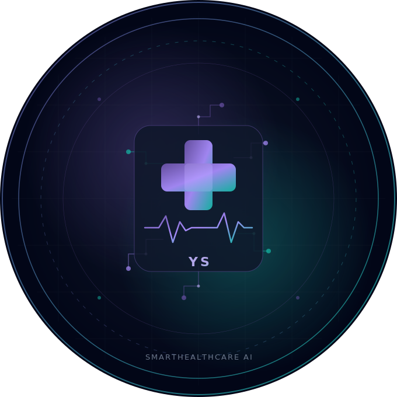

<br/><br/>

### **Yatin Sharma**

*`AI / ML Engineer` &nbsp;·&nbsp; `Final Year Project` &nbsp;·&nbsp; `SmartHealthCare AI`*

<br/>

[](https://github.com/YatinSharma1303)
&nbsp;
[](https://www.linkedin.com/in/yatin-sharma-793042372/)
&nbsp;
[](https://x.com/Yatin__Sharma)
&nbsp;
[](mailto:opportunities.yatin@gmail.com)

<br/>

> *"Bringing the power of AI to healthcare — one prediction at a time."*

<br/>

</div>

---

## 🤝 Contributing

Contributions, issues, and feature requests are welcome!

1. **Fork** the repository
2. **Create** your feature branch: `git checkout -b feature/amazing-feature`
3. **Commit** your changes: `git commit -m 'Add amazing feature'`
4. **Push** to the branch: `git push origin feature/amazing-feature`
5. **Open** a Pull Request

Please make sure to update tests and documentation as appropriate. If adding a new page, implement the floating widget pattern and `theme_config` integration to maintain design consistency.

---

## 📜 License

This project is licensed under the **MIT License** — see the [LICENSE](LICENSE) file for full details.

```
MIT License — Copyright (c) 2026 Yatin Sharma

Permission is hereby granted, free of charge, to any person obtaining a copy
of this software to use, copy, modify, merge, publish, distribute, sublicense,
and/or sell copies of the Software, subject to the above copyright notice
and this permission notice being included in all copies or substantial portions.
```

---

<div align="center">

<br/>

**References & Resources**

[](https://www.cdc.gov/brfss/)
&nbsp;
[](https://www.who.int/health-topics/cardiovascular-diseases)
&nbsp;
[](https://www.heart.org)
&nbsp;
[](https://console.groq.com)
&nbsp;
[](https://huggingface.co/sentence-transformers/all-MiniLM-L6-v2)
&nbsp;
[](https://langchain.com)

<br/>


<br/>

*Made with ❤️ by **Yatin Sharma** &nbsp;·&nbsp; SmartHealthCare AI — Material Design 3 Expressive*

</div>